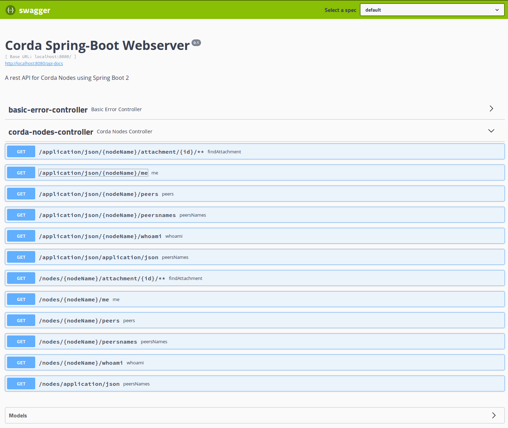

# Spring-Corda Integration

This project provides utilities and integration for Corda Spring developers

## Spring-Boot Starter

The starter autoconfiguration provides effortless bootstrapping of 
REST Controller and Service components that expose Corda Nodes via RPC. 

### Sample Configuration

Here's how to use the starter in your Spring-Boot app.

#### Starter Dependency

Add the dependency to your build replacing VERSION with the latest tag or 
`master-SNAPSHOT` 

##### Gradle Users

Add jitpack to your project repositories:

```groovy
allprojects {
	repositories {
		//...
		maven { url 'https://jitpack.io' }
	}
}
```

Add the starter dependency

```groovy
dependencies {
	implementation 'com.github.manosbatsis.corda-spring:spring-boot-corda-starter:VERSION'
}
```

##### Maven Users

Add jitpack to your project repositories:

```xml
<repositories>
	<repository>
		<id>jitpack.io</id>
		<url>https://jitpack.io</url>
	</repository>
</repositories>
```

Add the starter dependency

```xml
<dependency>
	<groupId>com.github.manosbatsis.corda-spring</groupId>
	<artifactId>spring-boot-corda-starter</artifactId>
	<version>VERSION</version>
</dependency>
```

#### Application Config

Add nodes in your `application.properties` following the example bellow. 
Use the party name for each node you want to the starter to register components for. 
In this example, we create components for nodes "PartyA", "PartyB" and "PartyC":

```properties
# node for PartyA
spring-corda.nodes.PartyA.username=user1
spring-corda.nodes.PartyA.password=test
spring-corda.nodes.PartyA.address=localhost:10006
spring-corda.nodes.PartyA.adminAddress=localhost:10046

# node for PartyB
spring-corda.nodes.PartyB.username=user1
spring-corda.nodes.PartyB.password=test
spring-corda.nodes.PartyB.address=localhost:10009
spring-corda.nodes.PartyB.adminAddress=localhost:10049

# node for PartyC
spring-corda.nodes.PartyC.username=user1
spring-corda.nodes.PartyC.password=test
spring-corda.nodes.PartyC.address=localhost:10012
spring-corda.nodes.PartyC.adminAddress=localhost:10052
```  

#### Registered Beans

The auto configuration will register the following beans per Corda Node added in the application config:


Bean Type          | Name                     | Description
------------------ | ------------------------ | -------------------
NodeRpcConnection  | {nodeName}RpcConnection  | Provides an Node RPC connection proxy
CordaNodeService   | {nodeName}NodeService     | A Node Service Bean

A controller is also added with endpoints eposing business methods for all configured nodes, see
the "Corda Webserver Boot" section bellow.

## Corda Webserver Boot

The corda-webserver-spring-boot module implements a replacement to Corda's default 
Node webserver. Run the server passing command line arguments to configured the nodes 
and browse [/swagger-ui.html](http://localhost:8080/swagger-ui.html) to view the available endpoints documentation 
generated by swagger



